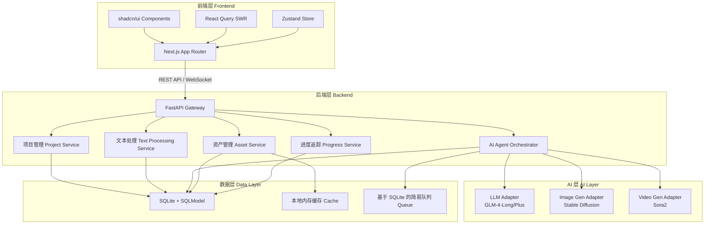
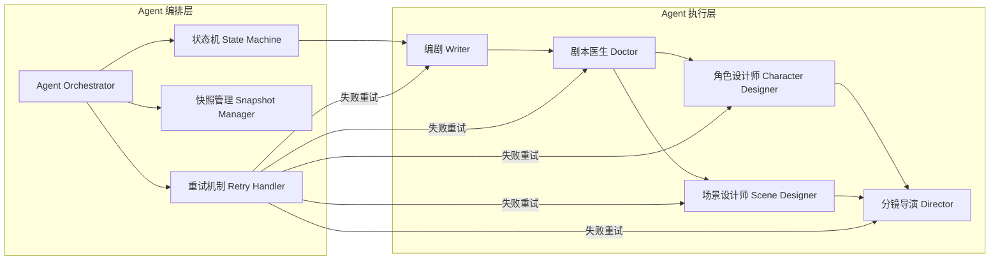

# Universal Story Board - 技术架构设计文档

**版本**: v1.0
**创建日期**: 2026-03-15
**产品代号**: Universal Story Board (USB)
**架构阶段**: Step 2 - 技术架构细化

---

## 1. 架构设计原则

### 1.1 核心原则：AI 编程优先

本项目的架构设计遵循 **「AI 编程友好优先」** 的技术选型原则，而非传统人类开发者最常用的技术栈。

**核心理念**:
- AI 代码生成能力（如 Claude、Cursor、GPT-4 Engineer）与特定技术栈的适配度
- 类型安全与结构化数据约束（便于 AI 理解和生成代码）
- Python 生态在 AI 领域的绝对优势
- 前端生态在组件库和 UI 生成方面的成熟度

### 1.2 技术选型原则

| 维度 | 选择标准 |
|------|----------|
| **后端语言** | Python 优先（AI 原生、类型注解强） |
| **前端框架** | React/Next.js 优先（组件库丰富、AI 生成质量高） |
| **数据库** | MVP 阶段优先轻量级，预留迁移路径 |
| **AI 集成** | Adapter 模式，支持多模型扩展 |
| **部署复杂度** | 单机可运行，后续可水平扩展 |

---

## 2. 整体架构图

### 2.1 系统分层架构



### 2.2 AI Agent 编排架构



---

## 3. 技术栈选型

### 3.1 后端技术栈

| 组件 | 技术选型 | 版本 | 说明 |
|------|----------|------|------|
| **语言** | Python | 3.11+ | AI 原生、类型注解强、生态丰富 |
| **Web 框架** | FastAPI | 0.104+ | 高性能、异步支持、自动生成 OpenAPI 文档 |
| **数据验证** | Pydantic | 2.5+ | 严格约束大模型 JSON 输出、类型安全 |
| **ORM** | SQLModel | 0.0.14+ | SQLAlchemy + Pydantic 的完美结合 |
| **数据库** | SQLite | 3.40+ | 轻量级、单文件、MVP 阶段首选 |
| **异步框架** | asyncio + uvicorn | - | Python 原生异步支持 |
| **任务队列** | 基于 SQLite 的简易队列 | - | MVP 阶段，无需 Redis |
| **缓存** | Python 字典 + TTL | - | 本地内存缓存，预留 Redis 接口 |

### 3.2 前端技术栈

| 组件 | 技术选型 | 版本 | 说明 |
|------|----------|------|------|
| **框架** | Next.js | 14+ | App Router、Server Components、AI 生成质量高 |
| **UI 库** | shadcn/ui | Latest | 基于 Radix UI，极简酷炫、可定制 |
| **样式** | TailwindCSS | 3.4+ | 原子化 CSS、AI 生成友好 |
| **状态管理** | Zustand | 4.4+ | 轻量级、API 简洁、AI 易理解 |
| **数据获取** | TanStack Query (React Query) | 5.0+ | 缓存、重试、乐观更新 |
| **表单** | React Hook Form + Zod | 7.x + 3.x | 类型安全的表单验证 |
| **动画** | Framer Motion | 11.0+ | 流畅的交互动画 |
| **图表** | Recharts | 2.10+ | 进度大盘可视化 |

### 3.3 AI 接口层技术栈

| 组件 | 技术选型 | 说明 |
|------|----------|------|
| **默认文本模型** | GLM-4-Long / GLM-4-Plus | 支持长文本（128k+ tokens） |
| **文生图模型** | Stable Diffusion / DALL-E 3 | Adapter 模式扩展 |
| **文生视频模型** | Sora2 / Runway Gen-2 | Adapter 模式扩展 |
| **HTTP 客户端** | httpx | 异步 HTTP 请求 |
| **速率限制** | slowapi | FastAPI 速率限制中间件 |

---

## 4. 后端架构设计

### 4.1 项目目录结构

```
universal-story-board/
├── backend/
│   ├── app/
│   │   ├── __init__.py
│   │   ├── main.py                 # FastAPI 应用入口
│   │   ├── config.py               # 配置管理（环境变量）
│   │   ├── database.py             # 数据库连接与会话管理
│   │   │
│   │   ├── api/                    # API 路由层
│   │   │   ├── __init__.py
│   │   │   ├── v1/
│   │   │   │   ├── __init__.py
│   │   │   │   ├── projects.py     # 项目管理接口
│   │   │   │   ├── chapters.py     # 章节管理接口
│   │   │   │   ├── assets.py      # 资产管理接口
│   │   │   │   ├── workflow.py    # 工作流触发接口
│   │   │   │   └── export.py      # 导出接口
│   │   │
│   │   ├── models/                 # SQLModel 数据模型
│   │   │   ├── __init__.py
│   │   │   ├── project.py
│   │   │   ├── chapter.py
│   │   │   ├── asset.py
│   │   │   ├── shot.py
│   │   │   └── global_snapshot.py
│   │   │
│   │   ├── schemas/                # Pydantic 请求/响应模型
│   │   │   ├── __init__.py
│   │   │   ├── project.py
│   │   │   ├── chapter.py
│   │   │   ├── asset.py
│   │   │   ├── shot.py
│   │   │   └── workflow.py
│   │   │
│   │   ├── services/               # 业务逻辑层
│   │   │   ├── __init__.py
│   │   │   ├── project_service.py
│   │   │   ├── chapter_service.py
│   │   │   ├── asset_service.py
│   │   │   └── progress_service.py
│   │   │
│   │   ├── agents/                 # AI Agent 编排层
│   │   │   ├── __init__.py
│   │   │   ├── orchestrator.py    # Agent 编排器
│   │   │   ├── state_machine.py   # 状态机
│   │   │   ├── snapshot_manager.py # 快照管理
│   │   │   ├── retry_handler.py   # 重试机制
│   │   │   │
│   │   │   ├── base_agent.py      # Agent 基类
│   │   │   ├── writer_agent.py    # 编剧 Agent
│   │   │   ├── doctor_agent.py    # 剧本医生 Agent
│   │   │   ├── character_agent.py # 角色设计师 Agent
│   │   │   ├── scene_agent.py     # 场景设计师 Agent
│   │   │   └── director_agent.py  # 分镜导演 Agent
│   │   │
│   │   ├── llm/                    # LLM 接口层
│   │   │   ├── __init__.py
│   │   │   ├── base_adapter.py    # Adapter 基类
│   │   │   ├── glm_adapter.py     # GLM 适配器
│   │   │   ├── sd_adapter.py      # Stable Diffusion 适配器
│   │   │   └── sora_adapter.py   # Sora2 适配器
│   │   │
│   │   ├── prompts/                # 提示词模板
│   │   │   ├── __init__.py
│   │   │   ├── writer_prompts.py
│   │   │   ├── doctor_prompts.py
│   │   │   ├── character_prompts.py
│   │   │   ├── scene_prompts.py
│   │   │   └── director_prompts.py
│   │   │
│   │   ├── utils/                  # 工具函数
│   │   │   ├── __init__.py
│   │   │   ├── text_processor.py  # 文本预处理
│   │   │   ├── cache.py           # 缓存封装（预留 Redis 接口）
│   │   │   └── queue.py           # 基于 SQLite 的简易队列
│   │   │
│   │   └── middleware/             # 中间件
│   │       ├── __init__.py
│   │       ├── cors.py
│   │       └── rate_limit.py
│   │
│   ├── tests/                     # 测试用例
│   │   ├── __init__.py
│   │   ├── test_api/
│   │   ├── test_agents/
│   │   └── test_utils/
│   │
│   ├── requirements.txt             # Python 依赖
│   └── .env.example               # 环境变量示例
│
└── frontend/                       # 前端应用（待创建）
```

### 4.2 核心模块设计

#### 4.2.1 Pydantic 约束大模型 JSON 输出

**设计目标**: 利用 Pydantic 的类型系统，严格约束大模型输出的 JSON 结构，确保数据完整性。

**实现方式**:

```python
# schemas/workflow.py

from pydantic import BaseModel, Field, field_validator
from typing import List, Dict, Optional
from enum import Enum

class AssetType(str, Enum):
    CHARACTER = "character"
    SCENE = "scene"
    PROP = "prop"

class CharacterAsset(BaseModel):
    """角色资产模型（严格约束大模型输出）"""
    id: str = Field(description="角色唯一标识")
    name: str = Field(min_length=1, max_length=50, description="角色姓名")
    age: str = Field(description="年龄段，如'青年'、'中年'")
    personality: List[str] = Field(min_items=1, description="性格特征列表")
    appearance: str = Field(min_length=10, description="外貌描述，至少10字")
    costume: str = Field(description="服装描述")
    props: List[str] = Field(default_factory=list, description="道具列表")
    prompts: Dict[str, str] = Field(
        description="文生图提示词字典，包含 portrait、full_body 等视角"
    )

    @field_validator('prompts')
    def validate_prompts(cls, v):
        required_keys = {'portrait', 'full_body'}
        if not all(k in v for k in required_keys):
            raise ValueError(f"prompts 必须包含 {required_keys}")
        return v

class SceneAsset(BaseModel):
    """场景资产模型"""
    id: str = Field(description="场景唯一标识")
    name: str = Field(min_length=1, max_length=50, description="场景名称")
    description: str = Field(min_length=20, description="场景描述，至少20字")
    time_of_day: str = Field(description="时间，如'白天'、'夜晚'")
    atmosphere: str = Field(description="氛围，如'宁静'、'紧张'")
    environment: str = Field(description="环境细节")
    prompts: Dict[str, str] = Field(
        description="文生图提示词字典，包含 wide_shot、detail 等视角"
    )

class Shot(BaseModel):
    """镜头模型"""
    shot_id: str = Field(description="镜头唯一标识")
    timecode: str = Field(pattern=r"\d{2}:\d{2}:\d{2}", description="时间码 HH:MM:SS")
    duration: int = Field(ge=1, le=30, description="时长（秒）")
    shot_type: str = Field(description="景别，如'中景'、'特写'")
    movement: Optional[str] = Field(default=None, description="镜头运动")
    dialogue: Optional[str] = Field(default=None, description="台词")
    audio: Optional[str] = Field(default=None, description="音效")
    visual_prompt: str = Field(min_length=10, description="视听提示词")

    @field_validator('dialogue')
    def validate_dialogue_entity_links(cls, v):
        """验证台词中的实体链接格式"""
        if v and '@' in v:
            import re
            pattern = r'@[\u4e00-\u9fa5a-zA-Z0-9_]+\[[^\]]+\]'
            if not re.search(pattern, v):
                raise ValueError("台词中的实体链接格式应为 @角色名[标签]")
        return v

class ScriptScene(BaseModel):
    """剧本场次模型"""
    scene_id: str = Field(description="场次唯一标识")
    scene_name: str = Field(description="场景名称")
    shots: List[Shot] = Field(min_items=1, description="镜头列表")

class ScriptOutput(BaseModel):
    """编剧输出模型（大模型必须遵循此结构）"""
    chapter_id: str = Field(description="章节ID")
    scenes: List[ScriptScene] = Field(min_items=1, description="场次列表")

    @field_validator('scenes')
    def validate_scene_continuity(cls, v):
        """验证场景连贯性（可选）"""
        # 可以添加自定义验证逻辑
        return v
```

**使用方式**:

```python
# agents/writer_agent.py

from pydantic import ValidationError
from app.schemas.workflow import ScriptOutput

class WriterAgent:
    def execute(self, context: dict) -> ScriptOutput:
        # 1. 构建提示词（包含 Pydantic 模型的 JSON Schema）
        prompt = self._build_prompt(context)

        # 2. 调用大模型
        raw_output = self.llm_client.chat(prompt)

        # 3. 使用 Pydantic 验证并解析 JSON
        try:
            script = ScriptOutput.model_validate_json(raw_output)
            return script
        except ValidationError as e:
            # 格式错误，自动重试或返回错误信息
            logger.error(f"大模型输出格式错误: {e}")
            raise
```

#### 4.2.2 多 Agent 状态调度

**设计目标**: 实现顺序编排、并行优化、重试与回滚的完整生命周期管理。

**状态机定义**:

```python
# agents/state_machine.py

from enum import Enum
from typing import Dict, Callable

class AgentType(str, Enum):
    WRITER = "writer"
    DOCTOR = "doctor"
    CHARACTER = "character"
    SCENE = "scene"
    DIRECTOR = "director"

class ChapterStatus(str, Enum):
    PENDING = "pending"
    PROCESSING = "processing"
    COMPLETED = "completed"
    FAILED = "failed"
    MANUAL_INTERVENTION = "manual_intervention"

class AgentStateMachine:
    """Agent 状态机"""

    # 定义状态转移规则
    TRANSITIONS = {
        ChapterStatus.PENDING: [AgentType.WRITER],
        AgentType.WRITER: [AgentType.DOCTOR, AgentType.CHARACTER],  # A 轨/B 轨分支
        AgentType.DOCTOR: [AgentType.WRITER, AgentType.CHARACTER],  # 重试/通过
        AgentType.CHARACTER: [AgentType.SCENE],
        AgentType.SCENE: [AgentType.DIRECTOR],
        AgentType.DIRECTOR: [ChapterStatus.COMPLETED, ChapterStatus.FAILED],
    }

    def __init__(self):
        self.current_state = ChapterStatus.PENDING
        self.current_agent: Optional[AgentType] = None
        self.retry_count = 0
        self.max_retries = 3

    def can_transition_to(self, target_agent: AgentType) -> bool:
        """检查是否可以转移到目标 Agent"""
        if self.current_agent is None:
            return target_agent in self.TRANSITIONS[self.current_state]
        return target_agent in self.TRANSITIONS.get(self.current_agent, [])

    def transition_to(self, agent: AgentType):
        """转移到目标 Agent"""
        if not self.can_transition_to(agent):
            raise ValueError(f"无法从 {self.current_agent} 转移到 {agent}")
        self.current_agent = agent
        self.current_state = ChapterStatus.PROCESSING

    def succeed(self):
        """当前 Agent 成功完成"""
        self.retry_count = 0

    def fail(self):
        """当前 Agent 失败"""
        self.retry_count += 1
        if self.retry_count >= self.max_retries:
            self.current_state = ChapterStatus.MANUAL_INTERVENTION
            raise Exception("超过最大重试次数，需人工介入")

    def complete(self):
        """整个流程完成"""
        self.current_state = ChapterStatus.COMPLETED
        self.current_agent = None
```

**编排器实现**:

```python
# agents/orchestrator.py

from app.agents.state_machine import AgentStateMachine, AgentType, ChapterStatus
from app.agents.base_agent import BaseAgent

class AgentOrchestrator:
    """Agent 编排器"""

    def __init__(self):
        self.state_machine = AgentStateMachine()
        self.agents: Dict[AgentType, BaseAgent] = {}
        self._register_agents()

    def _register_agents(self):
        """注册所有 Agent"""
        self.agents[AgentType.WRITER] = WriterAgent()
        self.agents[AgentType.DOCTOR] = DoctorAgent()
        self.agents[AgentType.CHARACTER] = CharacterAgent()
        self.agents[AgentType.SCENE] = SceneAgent()
        self.agents[AgentType.DIRECTOR] = DirectorAgent()

    def execute_workflow(self, chapter_id: str, mode: str = "A"):
        """执行工作流"""
        context = self._build_initial_context(chapter_id)

        if mode == "A":  # A 轨：改编编剧模式
            return self._execute_track_a(context)
        else:  # B 轨：原文模式
            return self._execute_track_b(context)

    def _execute_track_a(self, context: dict):
        """A 轨工作流"""
        # 1. 编剧
        context = self._execute_agent(AgentType.WRITER, context)

        # 2. 剧本医生
        while True:
            context = self._execute_agent(AgentType.DOCTOR, context)
            if context['score'] >= 80:  # 质量门通过
                break
            if self.state_machine.retry_count >= self.state_machine.max_retries:
                raise Exception("剧本医生评审未通过，需人工介入")

        # 3. 角色设计师
        context = self._execute_agent(AgentType.CHARACTER, context)

        # 4. 场景设计师
        context = self._execute_agent(AgentType.SCENE, context)

        # 5. 分镜导演
        context = self._execute_agent(AgentType.DIRECTOR, context)

        self.state_machine.complete()
        return context

    def _execute_track_b(self, context: dict):
        """B 轨工作流（跳过编剧和剧本医生）"""
        # 原文直接作为剧本
        context['script'] = context['original_text']

        # 角色设计师
        context = self._execute_agent(AgentType.CHARACTER, context)

        # 场景设计师
        context = self._execute_agent(AgentType.SCENE, context)

        # 分镜导演
        context = self._execute_agent(AgentType.DIRECTOR, context)

        self.state_machine.complete()
        return context

    def _execute_agent(self, agent_type: AgentType, context: dict) -> dict:
        """执行单个 Agent（含重试机制）"""
        agent = self.agents[agent_type]
        self.state_machine.transition_to(agent_type)

        while True:
            try:
                result = agent.execute(context)
                self.state_machine.succeed()
                return {**context, **result}
            except Exception as e:
                self.state_machine.fail()
                if self.state_machine.current_status == ChapterStatus.MANUAL_INTERVENTION:
                    raise
                logger.warning(f"{agent_type} 执行失败，第 {self.state_machine.retry_count} 次重试")
```

#### 4.2.3 全局快照管理

**设计目标**: 每完成一个章节，生成全局状态快照；处理新章节时，加载最新快照作为上下文。

**快照数据结构**:

```python
# models/global_snapshot.py

from sqlmodel import SQLModel, Field, Column, JSON
from datetime import datetime
from typing import Dict, List

class GlobalSnapshot(SQLModel, table=True):
    """全局状态快照"""
    id: str = Field(default_factory=lambda: str(uuid.uuid4()), primary_key=True)
    project_id: str = Field(foreign_key="project.id", index=True)
    version: int = Field(default=1, description="快照版本号")

    # 全局状态数据（JSON 字段）
    plot_summary: str = Field(default="", description="剧情摘要")
    characters: Dict = Field(default_factory=dict, sa_column=Column(JSON), description="角色资产引用")
    scenes: Dict = Field(default_factory=dict, sa_column=Column(JSON), description="场景资产引用")
    style_guide: Dict = Field(default_factory=dict, sa_column=Column(JSON), description="风格规范")

    # 元数据
    created_at: datetime = Field(default_factory=datetime.utcnow)
    chapter_count: int = Field(default=0, description="累计处理章节数")
```

**快照管理器**:

```python
# agents/snapshot_manager.py

from app.models.global_snapshot import GlobalSnapshot
from sqlalchemy.orm import Session

class SnapshotManager:
    """快照管理器"""

    def __init__(self, db: Session):
        self.db = db

    def create_snapshot(
        self,
        project_id: str,
        chapter_result: dict,
        assets: dict
    ) -> GlobalSnapshot:
        """创建新快照"""
        # 1. 加载最新快照（若存在）
        latest_snapshot = self.get_latest(project_id)
        version = (latest_snapshot.version + 1) if latest_snapshot else 1

        # 2. 增量更新（合并新资产）
        if latest_snapshot:
            characters = {**latest_snapshot.characters, **assets.get('characters', {})}
            scenes = {**latest_snapshot.scenes, **assets.get('scenes', {})}
        else:
            characters = assets.get('characters', {})
            scenes = assets.get('scenes', {})

        # 3. 更新剧情摘要（增量）
        plot_summary = self._update_plot_summary(
            latest_snapshot.plot_summary if latest_snapshot else "",
            chapter_result.get('script', "")
        )

        # 4. 创建快照
        snapshot = GlobalSnapshot(
            project_id=project_id,
            version=version,
            plot_summary=plot_summary,
            characters=characters,
            scenes=scenes,
            style_guide=chapter_result.get('style_guide', {}),
            chapter_count=(latest_snapshot.chapter_count + 1) if latest_snapshot else 1
        )

        self.db.add(snapshot)
        self.db.commit()
        self.db.refresh(snapshot)

        return snapshot

    def get_latest(self, project_id: str) -> Optional[GlobalSnapshot]:
        """获取最新快照"""
        return self.db.query(GlobalSnapshot).filter(
            GlobalSnapshot.project_id == project_id
        ).order_by(GlobalSnapshot.version.desc()).first()

    def load_as_context(self, project_id: str) -> dict:
        """加载快照作为上下文"""
        snapshot = self.get_latest(project_id)
        if not snapshot:
            return {}

        return {
            "plot_summary": snapshot.plot_summary,
            "existing_characters": snapshot.characters,
            "existing_scenes": snapshot.scenes,
            "style_guide": snapshot.style_guide,
            "global_version": snapshot.version
        }

    def _update_plot_summary(self, old_summary: str, new_script: str) -> str:
        """增量更新剧情摘要（可调用 LLM 进行智能摘要）"""
        # 这里可以使用 LLM 进行智能摘要合并
        # MVP 阶段可以简单拼接或截取
        if len(old_summary) + len(new_script) > 2000:  # 限制摘要长度
            return old_summary + "\n\n..." + new_script[-1000:]
        return old_summary + "\n\n" + new_script
```

#### 4.2.4 轻量级任务队列（基于 SQLite）

**设计目标**: MVP 阶段无需 Redis，实现基于 SQLite 的简易任务队列，预留向 Redis 迁移的接口。

**队列实现**:

```python
# utils/queue.py

import json
import time
from sqlmodel import Session, select
from typing import Optional, List
from datetime import datetime

class TaskStatus(str, Enum):
    PENDING = "pending"
    PROCESSING = "processing"
    COMPLETED = "completed"
    FAILED = "failed"

class TaskQueue:
    """基于 SQLite 的简易任务队列（预留 Redis 接口）"""

    def __init__(self, db: Session):
        self.db = db
        self._ensure_table()

    def _ensure_table(self):
        """确保任务表存在"""
        # 使用 SQLModel 定义 Task 模型，这里简化为直接 SQL
        self.db.exec("""
            CREATE TABLE IF NOT EXISTS task_queue (
                id TEXT PRIMARY KEY,
                task_type TEXT NOT NULL,
                payload TEXT NOT NULL,
                status TEXT NOT NULL,
                priority INTEGER DEFAULT 0,
                created_at TEXT NOT NULL,
                updated_at TEXT NOT NULL,
                retry_count INTEGER DEFAULT 0
            )
        """)
        self.db.commit()

    def enqueue(self, task_type: str, payload: dict, priority: int = 0) -> str:
        """入队"""
        task_id = str(uuid.uuid4())
        self.db.exec("""
            INSERT INTO task_queue (id, task_type, payload, status, priority, created_at, updated_at)
            VALUES (?, ?, ?, ?, ?, ?, ?)
        """, (task_id, task_type, json.dumps(payload), TaskStatus.PENDING, priority,
              datetime.utcnow().isoformat(), datetime.utcnow().isoformat()))
        self.db.commit()
        return task_id

    def dequeue(self) -> Optional[dict]:
        """出队（按优先级和时间）"""
        result = self.db.exec("""
            SELECT * FROM task_queue
            WHERE status = ?
            ORDER BY priority DESC, created_at ASC
            LIMIT 1
        """, (TaskStatus.PENDING,)).first()

        if not result:
            return None

        # 更新为处理中
        self.db.exec("""
            UPDATE task_queue
            SET status = ?, updated_at = ?
            WHERE id = ?
        """, (TaskStatus.PROCESSING, datetime.utcnow().isoformat(), result['id']))
        self.db.commit()

        return {
            "id": result['id'],
            "task_type": result['task_type'],
            "payload": json.loads(result['payload'])
        }

    def complete(self, task_id: str):
        """标记任务完成"""
        self.db.exec("""
            UPDATE task_queue
            SET status = ?, updated_at = ?
            WHERE id = ?
        """, (TaskStatus.COMPLETED, datetime.utcnow().isoformat(), task_id))
        self.db.commit()

    def fail(self, task_id: str):
        """标记任务失败（可重试）"""
        self.db.exec("""
            UPDATE task_queue
            SET status = ?, retry_count = retry_count + 1, updated_at = ?
            WHERE id = ?
        """, (TaskStatus.FAILED, datetime.utcnow().isoformat(), task_id))
        self.db.commit()

    def get_retryable_tasks(self, max_retries: int = 3) -> List[dict]:
        """获取可重试的任务"""
        result = self.db.exec("""
            SELECT * FROM task_queue
            WHERE status = ? AND retry_count < ?
            ORDER BY created_at ASC
        """, (TaskStatus.FAILED, max_retries)).all()

        return [
            {
                "id": r['id'],
                "task_type": r['task_type'],
                "payload": json.loads(r['payload']),
                "retry_count": r['retry_count']
            }
            for r in result
        ]
```

**缓存封装（预留 Redis 接口）**:

```python
# utils/cache.py

from typing import Any, Optional
from datetime import timedelta
import time

class CacheBackend:
    """缓存后端抽象基类（预留 Redis 接口）"""

    def get(self, key: str) -> Optional[Any]:
        raise NotImplementedError

    def set(self, key: str, value: Any, ttl: Optional[int] = None):
        raise NotImplementedError

    def delete(self, key: str):
        raise NotImplementedError

class MemoryCache(CacheBackend):
    """本地内存缓存（MVP 阶段）"""

    def __init__(self):
        self._cache: dict = {}
        self._ttl: dict = {}

    def get(self, key: str) -> Optional[Any]:
        if key not in self._cache:
            return None

        # 检查 TTL
        if key in self._ttl and time.time() > self._ttl[key]:
            del self._cache[key]
            del self._ttl[key]
            return None

        return self._cache[key]

    def set(self, key: str, value: Any, ttl: Optional[int] = None):
        self._cache[key] = value
        if ttl:
            self._ttl[key] = time.time() + ttl

    def delete(self, key: str):
        if key in self._cache:
            del self._cache[key]
        if key in self._ttl:
            del self._ttl[key]

class RedisCache(CacheBackend):
    """Redis 缓存（预留接口）"""

    def __init__(self, redis_url: str):
        import redis
        self.client = redis.from_url(redis_url)

    def get(self, key: str) -> Optional[Any]:
        import pickle
        value = self.client.get(key)
        if value is None:
            return None
        return pickle.loads(value)

    def set(self, key: str, value: Any, ttl: Optional[int] = None):
        import pickle
        serialized = pickle.dumps(value)
        self.client.set(key, serialized, ex=ttl)

    def delete(self, key: str):
        self.client.delete(key)

# 工厂函数，根据配置选择缓存后端
def create_cache(cache_type: str = "memory", **kwargs) -> CacheBackend:
    if cache_type == "memory":
        return MemoryCache()
    elif cache_type == "redis":
        return RedisCache(**kwargs)
    else:
        raise ValueError(f"不支持的缓存类型: {cache_type}")
```

### 4.3 AI 接口层设计

#### 4.3.1 Adapter 模式

**基类定义**:

```python
# llm/base_adapter.py

from abc import ABC, abstractmethod
from typing import Dict, List, Optional

class BaseLLMAdapter(ABC):
    """LLM 适配器基类"""

    @abstractmethod
    def chat(self, messages: List[Dict], temperature: float = 0.7) -> str:
        """聊天接口"""
        pass

    @abstractmethod
    def chat_with_json_output(
        self,
        messages: List[Dict],
        json_schema: Dict,
        temperature: float = 0.7
    ) -> Dict:
        """聊天接口，强制 JSON 输出"""
        pass

class BaseImageGenAdapter(ABC):
    """文生图适配器基类"""
    pass

class BaseVideoGenAdapter(ABC):
    """文生视频适配器基类"""
    pass
```

**GLM 适配器实现**:

```python
# llm/glm_adapter.py

from app.llm.base_adapter import BaseLLMAdapter
import httpx
import json

class GLMAdapter(BaseLLMAdapter):
    """GLM-4-Long / GLM-4-Plus 适配器"""

    def __init__(self, api_key: str, model: str = "glm-4-long"):
        self.api_key = api_key
        self.model = model
        self.base_url = "https://open.bigmodel.cn/api/paas/v4/chat/completions"
        self.client = httpx.AsyncClient(timeout=300)  # 长文本需要更长的超时

    async def chat(self, messages: List[Dict], temperature: float = 0.7) -> str:
        """普通聊天接口"""
        payload = {
            "model": self.model,
            "messages": messages,
            "temperature": temperature
        }

        headers = {
            "Authorization": f"Bearer {self.api_key}",
            "Content-Type": "application/json"
        }

        response = await self.client.post(self.base_url, json=payload, headers=headers)
        response.raise_for_status()
        result = response.json()

        return result['choices'][0]['message']['content']

    async def chat_with_json_output(
        self,
        messages: List[Dict],
        json_schema: Dict,
        temperature: float = 0.7
    ) -> Dict:
        """强制 JSON 输出（GLM-4-Long 支持）"""
        # 在系统消息中指定 JSON Schema
        system_message = {
            "role": "system",
            "content": f"""你必须严格按照以下 JSON Schema 输出，不要添加任何额外文字：

```json
{json.dumps(json_schema, ensure_ascii=False, indent=2)}
```"""
        }

        # 将系统消息插入到最前面
        all_messages = [system_message] + messages

        # 调用 chat 接口
        content = await self.chat(all_messages, temperature)

        # 解析 JSON
        try:
            return json.loads(content)
        except json.JSONDecodeError as e:
            raise ValueError(f"GLM 返回的 JSON 格式错误: {content}") from e
```

**适配器工厂**:

```python
# llm/factory.py

from app.llm.base_adapter import BaseLLMAdapter
from app.llm.glm_adapter import GLMAdapter

def create_llm_adapter(provider: str, config: Dict) -> BaseLLMAdapter:
    """LLM 适配器工厂"""
    if provider == "glm":
        return GLMAdapter(
            api_key=config['api_key'],
            model=config.get('model', 'glm-4-long')
        )
    elif provider == "openai":
        # 预留 OpenAI 接口
        raise NotImplementedError("OpenAI 适配器待实现")
    else:
        raise ValueError(f"不支持的 LLM 提供商: {provider}")
```

---

## 5. 前端架构设计

### 5.1 项目目录结构

```
frontend/
├── app/
│   ├── layout.tsx              # 根布局
│   ├── page.tsx                # 首页（项目列表）
│   ├── globals.css             # 全局样式
│   │
│   ├── (auth)/                # 认证相关页面组
│   │   └── login/
│   │       └── page.tsx
│   │
│   ├── projects/              # 项目页面组
│   │   ├── [id]/
│   │   │   ├── page.tsx       # 项目详情
│   │   │   ├── chapters/
│   │   │   │   └── page.tsx  # 章节列表
│   │   │   ├── assets/
│   │   │   │   └── page.tsx  # 资产库
│   │   │   └── storyboard/
│   │   │       └── page.tsx  # 分镜查看
│   │   └── new/
│   │       └── page.tsx       # 新建项目
│   │
│   ├── components/            # 组件库
│   │   ├── ui/               # shadcn/ui 组件
│   │   │   ├── button.tsx
│   │   │   ├── card.tsx
│   │   │   ├── dialog.tsx
│   │   │   ├── progress.tsx
│   │   │   └── ...
│   │   │
│   │   ├── project-card.tsx   # 项目卡片
│   │   ├── chapter-item.tsx   # 章节项
│   │   ├── asset-tag.tsx      # 资产标签
│   │   ├── shot-viewer.tsx    # 镜头查看器
│   │   └── workflow-progress.tsx  # 工作流进度
│   │
│   ├── lib/                  # 工具库
│   │   ├── api.ts            # API 客户端
│   │   ├── utils.ts          # 工具函数
│   │   └── validators.ts     # Zod 验证器
│   │
│   ├── hooks/                # React Hooks
│   │   ├── use-workflow.ts   # 工作流 Hook
│   │   ├── use-assets.ts     # 资产 Hook
│   │   └── use-progress.ts   # 进度 Hook
│   │
│   ├── stores/               # Zustand 状态管理
│   │   ├── project-store.ts
│   │   ├── workflow-store.ts
│   │   └── ui-store.ts
│   │
│   └── types/                # TypeScript 类型定义
│       ├── project.ts
│       ├── chapter.ts
│       ├── asset.ts
│       └── workflow.ts
│
├── public/                   # 静态资源
├── components.json           # shadcn/ui 配置
├── tailwind.config.ts       # TailwindCSS 配置
├── tsconfig.json           # TypeScript 配置
└── package.json            # 依赖管理
```

### 5.2 核心组件设计

#### 5.2.1 shadcn/ui 集成

**shadcn/ui 优势**:
- 基于 Radix UI，可访问性优秀
- 组件可定制性强，AI 生成友好
- 与 TailwindCSS 完美集成
- 社区活跃，文档完善

**安装与配置**:

```bash
# 初始化 shadcn/ui
npx shadcn-ui@latest init

# 安装常用组件
npx shadcn-ui@latest add button card dialog progress badge
npx shadcn-ui@latest add input textarea select checkbox
npx shadcn-ui@latest add dropdown-menu popover tabs
```

#### 5.2.2 资产标签组件（Asset Tag）

```tsx
// app/components/asset-tag.tsx

"use client"

import { Badge } from "@/components/ui/badge"
import { Card } from "@/components/ui/card"
import { useState } from "react"
import { Asset } from "@/types/asset"

interface AssetTagProps {
  asset: Asset
  onClick?: () => void
}

export function AssetTag({ asset, onClick }: AssetTagProps) {
  const [showCard, setShowCard] = useState(false)

  const getBadgeColor = () => {
    switch (asset.type) {
      case "character":
        return "bg-blue-100 text-blue-800 hover:bg-blue-200"
      case "scene":
        return "bg-green-100 text-green-800 hover:bg-green-200"
      case "prop":
        return "bg-orange-100 text-orange-800 hover:bg-orange-200"
      default:
        return "bg-gray-100 text-gray-800"
    }
  }

  return (
    <>
      <Badge
        className={`cursor-pointer transition-colors ${getBadgeColor()}`}
        onClick={onClick}
      >
        @{asset.name}{asset.tags && asset.tags.length > 0 && (
          <span className="ml-1">[{asset.tags.join(", ")}]</span>
        )}
      </Badge>

      {showCard && (
        <Card className="absolute z-50 w-80 p-4 shadow-lg">
          <div className="space-y-2">
            <div className="flex items-center gap-3">
              {asset.image_url && (
                
              )}
              <div>
                <h3 className="font-semibold">{asset.name}</h3>
                <p className="text-sm text-gray-600">{asset.description}</p>
              </div>
            </div>
            <div className="space-y-1 text-sm">
              <p><strong>提示词:</strong></p>
              <p className="rounded bg-gray-100 p-2 text-xs font-mono">
                {asset.prompts?.portrait || "未生成"}
              </p>
            </div>
            <div className="flex justify-between">
              <button className="text-sm text-blue-600 hover:underline">
                查看详情
              </button>
              <button
                className="text-sm text-gray-600 hover:underline"
                onClick={() => setShowCard(false)}
              >
                关闭
              </button>
            </div>
          </div>
        </Card>
      )}
    </>
  )
}
```

#### 5.2.3 工作流进度组件

```tsx
// app/components/workflow-progress.tsx

"use client"

import { Progress } from "@/components/ui/progress"
import { Card } from "@/components/ui/card"
import { CheckCircle, Clock, XCircle, AlertCircle } from "lucide-react"
import { ChapterStatus, AgentType } from "@/types/workflow"

interface WorkflowProgressProps {
  status: ChapterStatus
  currentAgent: AgentType | null
  retryCount: number
}

const AGENT_NAMES: Record<AgentType, string> = {
  writer: "编剧",
  doctor: "剧本医生",
  character: "角色设计师",
  scene: "场景设计师",
  director: "分镜导演"
}

export function WorkflowProgress({ status, currentAgent, retryCount }: WorkflowProgressProps) {
  const getProgress = () => {
    if (status === "completed") return 100
    if (currentAgent === "writer") return 20
    if (currentAgent === "doctor") return 40
    if (currentAgent === "character") return 60
    if (currentAgent === "scene") return 80
    if (currentAgent === "director") return 90
    return 0
  }

  const getStatusIcon = () => {
    if (status === "completed") return <CheckCircle className="h-5 w-5 text-green-600" />
    if (status === "failed") return <XCircle className="h-5 w-5 text-red-600" />
    if (status === "manual_intervention") return <AlertCircle className="h-5 w-5 text-yellow-600" />
    return <Clock className="h-5 w-5 text-blue-600 animate-pulse" />
  }

  return (
    <Card className="p-4">
      <div className="mb-3 flex items-center justify-between">
        <h3 className="font-semibold">处理进度</h3>
        <div className="flex items-center gap-2">
          {getStatusIcon()}
          {currentAgent && (
            <span className="text-sm text-gray-600">
              正在由 {AGENT_NAMES[currentAgent]} 处理...
            </span>
          )}
        </div>
      </div>
      <Progress value={getProgress()} className="mb-2" />
      <div className="flex justify-between text-xs text-gray-500">
        <span>编剧</span>
        <span>剧本医生</span>
        <span>角色设计</span>
        <span>场景设计</span>
        <span>分镜</span>
      </div>
      {retryCount > 0 && (
        <div className="mt-2 text-xs text-orange-600">
          已重试 {retryCount} 次
        </div>
      )}
    </Card>
  )
}
```

---

## 6. 数据库迁移策略

### 6.1 MVP 阶段（SQLite）

**优势**:
- 单文件数据库，无需独立服务
- 零配置，开箱即用
- 适合单机部署
- Python 内置支持，无需额外依赖

**配置**:

```python
# app/database.py

from sqlmodel import SQLModel, create_engine, Session
from app.config import settings

engine = create_engine(
    settings.database_url,
    connect_args={"check_same_thread": False}  # SQLite 特有配置
)

def init_db():
    """初始化数据库"""
    SQLModel.metadata.create_all(engine)

def get_session():
    """获取数据库会话"""
    with Session(engine) as session:
        yield session
```

### 6.2 迁移到 PostgreSQL + Redis

**预留接口设计**:

```python
# app/config.py

from pydantic_settings import BaseSettings

class Settings(BaseSettings):
    # 数据库配置
    database_type: str = "sqlite"  # sqlite | postgresql
    database_url: str = "sqlite:///./usb.db"

    # 缓存配置
    cache_type: str = "memory"  # memory | redis
    redis_url: str | None = None

    # ... 其他配置

    class Config:
        env_file = ".env"

settings = Settings()

# app/database.py（扩展版本）

from app.config import settings

if settings.database_type == "sqlite":
    engine = create_engine(
        settings.database_url,
        connect_args={"check_same_thread": False}
    )
elif settings.database_type == "postgresql":
    engine = create_engine(settings.database_url)
else:
    raise ValueError(f"不支持的数据库类型: {settings.database_type}")

# app/utils/cache.py（扩展版本）

from app.config import settings

cache = create_cache(
    cache_type=settings.cache_type,
    redis_url=settings.redis_url
)
```

**迁移步骤**:

1. **数据导出**: 使用 `sqlmodel` 导出 SQLite 数据为 JSON
2. **环境变量配置**: 切换 `DATABASE_TYPE=postgresql` 和 `CACHE_TYPE=redis`
3. **数据导入**: 将 JSON 数据导入 PostgreSQL
4. **验证**: 运行测试用例确保数据完整性

---

## 7. 核心接口定义

### 7.1 项目管理接口

```python
# api/v1/projects.py

from fastapi import APIRouter, Depends, HTTPException
from sqlmodel import Session
from app.schemas.project import ProjectCreate, ProjectRead, ProjectUpdate
from app.services.project_service import ProjectService

router = APIRouter(prefix="/projects", tags=["projects"])

@router.post("", response_model=ProjectRead)
async def create_project(
    project: ProjectCreate,
    session: Session = Depends(get_session)
):
    """创建新项目"""
    service = ProjectService(session)
    return service.create_project(project)

@router.get("", response_model=list[ProjectRead])
async def list_projects(
    skip: int = 0,
    limit: int = 20,
    session: Session = Depends(get_session)
):
    """列出所有项目"""
    service = ProjectService(session)
    return service.list_projects(skip=skip, limit=limit)

@router.get("/{project_id}", response_model=ProjectRead)
async def get_project(
    project_id: str,
    session: Session = Depends(get_session)
):
    """获取项目详情"""
    service = ProjectService(session)
    project = service.get_project(project_id)
    if not project:
        raise HTTPException(status_code=404, detail="项目不存在")
    return project

@router.patch("/{project_id}", response_model=ProjectRead)
async def update_project(
    project_id: str,
    project: ProjectUpdate,
    session: Session = Depends(get_session)
):
    """更新项目"""
    service = ProjectService(session)
    return service.update_project(project_id, project)

@router.delete("/{project_id}")
async def delete_project(
    project_id: str,
    session: Session = Depends(get_session)
):
    """删除项目"""
    service = ProjectService(session)
    service.delete_project(project_id)
    return {"message": "项目已删除"}
```

### 7.2 工作流接口

```python
# api/v1/workflow.py

from fastapi import APIRouter, Depends, BackgroundTasks
from sqlmodel import Session
from app.schemas.workflow import WorkflowStartRequest, WorkflowStatusResponse
from app.agents.orchestrator import AgentOrchestrator

router = APIRouter(prefix="/workflow", tags=["workflow"])

@router.post("/start")
async def start_workflow(
    request: WorkflowStartRequest,
    background_tasks: BackgroundTasks,
    session: Session = Depends(get_session)
):
    """启动工作流（异步执行）"""
    orchestrator = AgentOrchestrator(session)

    # 将任务加入队列
    task_id = task_queue.enqueue(
        task_type="chapter_workflow",
        payload={
            "chapter_id": request.chapter_id,
            "mode": request.mode  # "A" or "B"
        }
    )

    # 后台任务处理
    background_tasks.add_task(
        process_workflow_task,
        task_id,
        request.chapter_id,
        request.mode
    )

    return {"task_id": task_id, "status": "pending"}

@router.get("/status/{task_id}", response_model=WorkflowStatusResponse)
async def get_workflow_status(task_id: str):
    """获取工作流状态"""
    task = task_queue.get_task(task_id)
    if not task:
        raise HTTPException(status_code=404, detail="任务不存在")
    return {
        "task_id": task["id"],
        "status": task["status"],
        "current_agent": task.get("current_agent"),
        "retry_count": task.get("retry_count", 0)
    }
```

---

## 8. 部署架构

### 8.1 MVP 阶段（单机部署）

```
┌─────────────────────────────────────┐
│         轻量级云服务器               │
│  (2核4G / 40G SSD)                │
│                                     │
│  ┌─────────────────────────────┐   │
│  │    Docker Compose          │   │
│  │                           │   │
│  │  ┌──────────────────┐    │   │
│  │  │  Nginx (80/443) │    │   │
│  │  └────────┬─────────┘    │   │
│  │           │               │   │
│  │  ┌────────▼─────────┐    │   │
│  │  │  Next.js Frontend │    │   │
│  │  │  (Port: 3000)    │    │   │
│  │  └────────┬─────────┘    │   │
│  │           │               │   │
│  │  ┌────────▼─────────┐    │   │
│  │  │  FastAPI Backend │    │   │
│  │  │  (Port: 8000)    │    │   │
│  │  │                   │    │   │
│  │  │  ┌─────────────┐ │    │   │
│  │  │  │  SQLite DB  │ │    │   │
│  │  │  │  (usb.db)   │ │    │   │
│  │  │  └─────────────┘ │    │   │
│  │  │                   │    │   │
│  │  │  ┌─────────────┐ │    │   │
│  │  │  │  Mem Cache  │ │    │   │
│  │  │  └─────────────┘ │    │   │
│  │  │                   │    │   │
│  │  │  ┌─────────────┐ │    │   │
│  │  │  │  SQLite Q   │ │    │   │
│  │  │  └─────────────┘ │    │   │
│  │  └──────────────────┘    │   │
│  └───────────────────────────┘   │
└─────────────────────────────────────┘
```

**Docker Compose 配置**:

```yaml
# docker-compose.yml

version: '3.8'

services:
  frontend:
    build: ./frontend
    ports:
      - "3000:3000"
    environment:
      - NEXT_PUBLIC_API_URL=http://backend:8000

  backend:
    build: ./backend
    ports:
      - "8000:8000"
    volumes:
      - ./data:/app/data
    environment:
      - DATABASE_URL=sqlite:///./data/usb.db
      - CACHE_TYPE=memory

  nginx:
    image: nginx:alpine
    ports:
      - "80:80"
    volumes:
      - ./nginx.conf:/etc/nginx/nginx.conf
    depends_on:
      - frontend
      - backend
```

### 8.2 生产环境（扩展架构）

```
┌─────────────────────────────────────────────────────┐
│              负载均衡层                              │
│              (Nginx / ALB)                          │
└──────────────┬──────────────────────────────────────┘
               │
       ┌───────┴───────┐
       │               │
┌──────▼──────┐  ┌───▼────┐
│  Frontend   │  │  CDN   │
│  (Next.js) │  │        │
└──────┬──────┘  └────────┘
       │
┌──────▼───────────────────────────────────────────┐
│              API 网关层                          │
│          (FastAPI Gateway)                       │
└──────┬───────────────────────────────────────────┘
       │
       ├─── 项目服务 ───┬─── PostgreSQL
       │
       ├─── 工作流服务 ─┼─── Redis (缓存 + 队列)
       │
       └─── 资产服务 ────┴─── MinIO (对象存储)
```

---

## 9. 性能优化策略

### 9.1 后端优化

| 策略 | 实现方式 |
|------|----------|
| **异步 I/O** | FastAPI + asyncio，所有 HTTP 调用异步化 |
| **数据库连接池** | SQLAlchemy 连接池配置 |
| **批量查询** | 使用 SQLModel 的 `select().where()` 批量加载 |
| **缓存热点数据** | 项目全局状态、频繁访问的资产 |
| **LLM 调用优化** | 并行调用、长文本摘要缓存 |

### 9.2 前端优化

| 策略 | 实现方式 |
|------|----------|
| **服务端渲染** | Next.js SSR，首屏优化 |
| **React Query 缓存** | 自动缓存 API 响应，减少重复请求 |
| **组件懒加载** | `React.lazy()` + `Suspense` |
| **图片优化** | Next.js Image 组件，自动 WebP 转换 |
| **代码分割** | 路由级别的动态导入 |

---

## 10. 安全性设计

### 10.1 API 安全

| 措施 | 实现方式 |
|------|----------|
| **速率限制** | `slowapi` 中间件，限制单 IP 请求频率 |
| **CORS 配置** | 仅允许可信域名 |
| **输入验证** | Pydantic 严格验证所有请求参数 |
| **SQL 注入防护** | SQLModel 参数化查询 |
| **密钥加密存储** | 环境变量 + `.env` 文件（不提交到 Git） |

### 10.2 数据安全

| 措施 | 实现方式 |
|------|----------|
| **敏感数据脱敏** | 日志中不记录 API Key、完整用户输入 |
| **备份策略** | SQLite 数据库每日备份到对象存储 |
| **访问控制** | 项目级权限管理（后续实现） |

---

## 11. 开发与测试

### 11.1 开发环境搭建

```bash
# 1. 克隆仓库
git clone git@github.com:Aries233/universal-story-board.git
cd universal-story-board

# 2. 后端环境
cd backend
python -m venv venv
source venv/bin/activate  # Windows: venv\Scripts\activate
pip install -r requirements.txt
cp .env.example .env  # 配置环境变量

# 3. 前端环境
cd ../frontend
npm install
cp .env.example .env.local  # 配置环境变量

# 4. 启动开发服务器
# 后端终端
cd backend && uvicorn app.main:app --reload --port 8000

# 前端终端
cd frontend && npm run dev
```

### 11.2 测试策略

| 类型 | 工具 | 覆盖范围 |
|------|------|----------|
| **单元测试** | pytest | Agent 逻辑、工具函数 |
| **集成测试** | pytest + httpx | API 接口 |
| **端到端测试** | Playwright | 用户流程（可选） |
| **类型检查** | mypy | Python 类型检查 |

---

## 12. 后续扩展方向

### 12.1 技术扩展

- **水平扩展**: FastAPI 部署多实例，Nginx 负载均衡
- **数据库读写分离**: PostgreSQL 主从复制
- **消息队列升级**: Redis → RabbitMQ / Kafka
- **文件存储升级**: MinIO → AWS S3 / 阿里云 OSS

### 12.2 功能扩展

- **实时协作**: WebSocket 支持多人同时编辑
- **插件系统**: 社区贡献自定义 Agent
- **模板市场**: 创作者分享分镜模板
- **多语言支持**: i18n 国际化

---

**文档维护者**: 虎斑 (Universal Story Board 技术架构师)
**最后更新**: 2026-03-15
