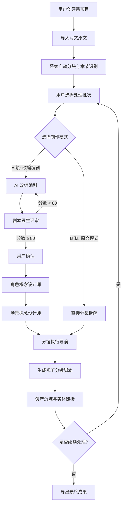
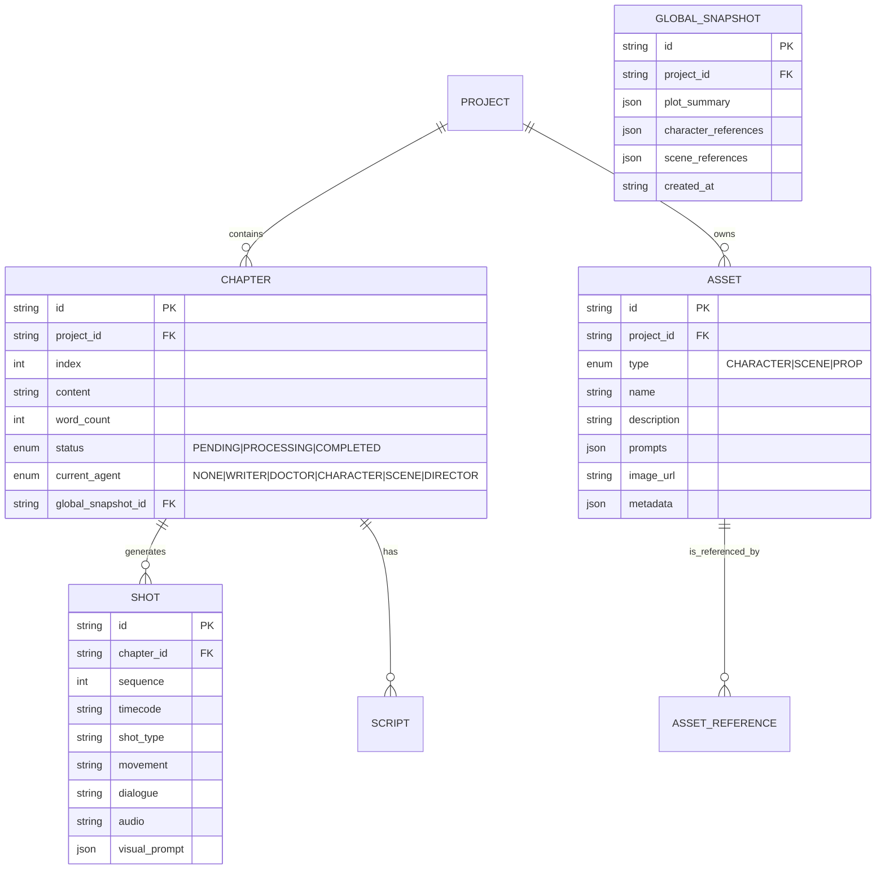
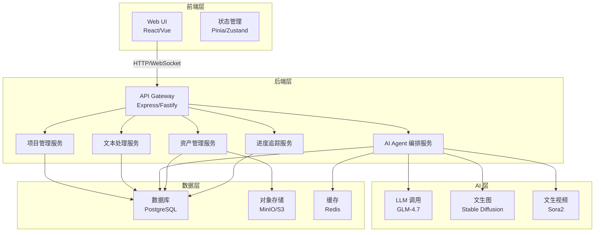

# 一站式网文转分镜/漫剧脚本平台 - 产品需求文档 (PRD)

**版本**: v1.0
**创建日期**: 2026-03-15
**产品代号**: Universal Story Board (USB)
**文档状态**: 初始设计阶段

---

## 1. 产品愿景

### 1.1 核心价值主张

为创作者提供「从网文到可视化分镜」的**零门槛、全自动化**解决方案。通过多模态 AI 协作流水线，将长达数万字的长篇网文，在保持剧情连贯性的前提下，转换为可用于动画、漫剧、短视频制作的分镜脚本及视觉资产库。

### 1.2 目标用户

- **主创团队**: 网文作者、漫剧制作公司、动画工作室
- **内容创作者**: 短视频 UP 主、二创创作者、影视爱好者
- **专业从业者**: 编剧、分镜师、概念设计师

### 1.3 产品定位

**「网文的视觉化翻译引擎」** — 不是简单的文本生成工具，而是具备工业级工作流的 AI 协作平台，支持长篇项目的资产沉淀与版本管理。

---

## 2. 核心名词解释

| 术语 | 定义 |
|------|------|
| **项目 (Project)** | 一个完整的网文改编项目，包含原文、剧本、角色资产、场景资产、分镜脚本等所有数据 |
| **章节 (Chapter)** | 网文的最小处理单元，通常 1000-2000 字，对应一集/一期的内容量 |
| **批次 (Batch)** | 一次性处理的章节集合，支持用户选择连续或非连续的章节 |
| **全局项目状态 (Global State)** | 跨章节共享的上下文数据，包含剧情摘要、角色人设库、场景世界观、风格规范 |
| **实体资产 (Entity Asset)** | 固定的创作资产，包括角色（Character）、场景（Scene）、道具（Prop）等 |
| **实体链接 (Entity Link)** | 在分镜脚本中对资产的可视化引用，如 `@林峰[青年]`，点击可查看资产详情 |
| **双轨模式 (Dual-Track Mode)** | A 轨：改编编剧模式（AI 改写 + 审核流程）<br>B 轨：原文模式（直接拆解，无改写） |
| **AI Agent** | 承担特定创作任务的 AI 智能体，包含编剧、剧本医生、角色设计师、场景设计师、分镜导演 |
| **质量门 (Quality Gate)** | 剧本评审的打分阈值机制（默认 80 分），低于阈值触发自动重试或人工介入 |
| **视场镜 (Shot)** | 分镜的最小单元，包含时间码、景别、镜头运动、台词、音效等视听信息 |
| **视听提示词 (AV Prompt)** | 供文生图/文生视频 API 使用的结构化提示词，包含画面描述、风格、构图等 |

---

## 3. 用户使用流程

### 3.1 整体流程图



### 3.2 核心交互路径

#### 路径 1: 首次创建项目
```
1. 点击「新建项目」
2. 上传或粘贴网文（5000-10000 字）
3. 系统自动识别章节结构（基于空行、标题标记等）
4. 展示章节列表及字数统计
5. 用户确认分块结果，手动调整（可选）
```

#### 路径 2: 批次处理与连贯性管理
```
1. 用户选择要处理的章节（支持多选、范围选择）
2. 系统加载全局项目状态（剧情摘要、角色库、场景库）
3. AI 编剧师基于前文上下文生成新章节剧本
4. 实体资产自动继承（如已有角色「林峰」，不再重新设计）
5. 新生成的角色/场景自动追加到资产库
```

#### 路径 3: A 轨质量评审流程
```
1. AI 编剧师输出剧本草案
2. 剧本医生打分（0-100 分）
3. 若分数 < 80：输出修改意见 → 自动重试（最多 3 次）→ 仍失败则提示「需人工介入」
4. 若分数 ≥ 80：展示剧本 + 评分 → 用户确认「通过」或「手动修改」
5. 用户确认后流转至下一环节
```

#### 路径 4: 资产管理交互
```
1. 在分镜脚本中点击实体链接 `@林峰[青年]`
2. 弹出资产详情卡片：角色人设、服化道描述、文生图提示词、生成的图片预览
3. 支持操作：
   - 复制提示词
   - 上传/回填生成的图片 URL
   - 编辑提示词并重新生成
   - 查看该角色在哪些章节中出现
```

---

## 4. 功能模块拆解

### 4.1 项目管理模块

#### 4.1.1 项目创建与配置
- **功能点**:
  - 创建新项目（项目名称、备注、预设风格）
  - 导入网文（支持粘贴、上传 TXT/PDF）
  - 自动分块与章节识别
  - 项目配置（默认模型选择、质量门阈值、最大重试次数）

- **UI 交互**:
  - 极简向导式引导（Step 1 → Step 2 → Step 3）
  - 实时预览分块效果
  - 支持手动合并/拆分章节

#### 4.1.2 项目列表与大盘
- **功能点**:
  - 项目卡片展示（封面、名称、进度、最后更新时间）
  - 大盘看板（总项目数、进行中、已完成、资产统计）
  - 快捷操作（继续处理、导出、归档、删除）

- **UI 交互**:
  - 卡片式网格布局
  - 进度条可视化
  - 支持搜索、筛选、排序

### 4.2 文本处理模块

#### 4.2.1 长文本预处理
- **功能点**:
  - 标点规范化（统一全角/半角）
  - 排版清理（去除多余空行、特殊字符）
  - 章节识别（基于标题标记、空行分隔、段落长度等规则）
  - 字数统计与进度展示

- **UI 交互**:
  - 实时显示处理字数 / 总字数
  - 章节列表可折叠/展开
  - 支持手动调整章节边界（拖拽分界线）

#### 4.2.2 章节批次管理
- **功能点**:
  - 多选章节（Ctrl/Cmd + 点击）
  - 范围选择（Shift + 点击）
  - 批次预览（选中章节的总字数、预估时间）

- **UI 交互**:
  - 复选框多选
  - 选中状态高亮
  - 底部浮动栏显示批次信息与「开始处理」按钮

### 4.3 AI Agent 工作流模块

#### 4.3.1 改编编剧模式（A 轨）

**子模块 1: AI 编剧师**
- **输入**: 章节原文 + 全局项目状态（前文剧情摘要、角色库、场景库）
- **输出**: 改编剧本（分场次、含台词、动作描述）
- **配置**: 风格偏好（严肃/轻松、现代/古风等）

**子模块 2: 剧本医生**
- **输入**: 剧本草案
- **输出**: 评分 + 修改意见（可选）
- **规则**: 质量门阈值、最大重试次数

**子模块 3: 用户确认环节**
- **展示内容**:
  - 剧本正文（可编辑）
  - 医生评分与评语
  - 修改历史（若发生过重试）
- **操作**: 通过 / 手动修改 / 重新生成

#### 4.3.2 原文模式（B 轨）
- **输入**: 章节原文 + 全局项目状态
- **输出**: 直接拆解的分镜脚本（无改写）
- **技术实现**: NLP 模型识别场次、角色、场景，轻量级大模型补全视听元素

#### 4.3.3 角色概念设计师
- **输入**: 剧本中的角色出场段落
- **输出**:
  - 角色人设（姓名、年龄、性格、外貌描述）
  - 服化道设计（服装、道具、发型、妆容）
  - 文生图提示词（结构化 JSON 格式）
- **全局资产匹配**: 若角色已存在于资产库，则跳过生成，直接引用

#### 4.3.4 场景概念设计师
- **输入**: 剧本中的场景描述
- **输出**:
  - 场景设定（地点、时间、氛围、环境细节）
  - 文生图提示词
- **全局资产匹配**: 同角色逻辑

#### 4.3.5 分镜执行导演
- **输入**: 剧本 + 角色资产 + 场景资产
- **输出**:
  - 视听分镜脚本（场次序列）
  - 每个镜头的时间码、景别、镜头运动、台词、音效
  - 实体链接（`@角色名[标签]`、`@场景名`）
  - 视听提示词（供文生图/视频 API 使用）

### 4.4 资产管理模块

#### 4.4.1 资产库
- **功能点**:
  - 角色库（列表视图、卡片视图）
  - 场景库（同上）
  - 资产详情（人设、提示词、图片预览、引用章节）
  - 资产编辑（提示词打磨、图片回填）

- **UI 交互**:
  - 搜索与筛选（按名称、标签、引用章节）
  - 点击资产跳转到分镜中的引用位置
  - 支持导出资产库（JSON/CSV）

#### 4.4.2 实体链接可视化
- **功能点**:
  - 在分镜脚本中渲染为高亮 Tag
  - 悬停显示资产预览
  - 点击展开资产详情卡片

- **UI 交互**:
  - Tag 颜色编码（角色=蓝色、场景=绿色、道具=橙色）
  - 卡片支持拖拽移动、关闭
  - 卡片内支持「跳转至所有引用」

### 4.5 进度管理模块

#### 4.5.1 章节进度追踪
- **展示维度**:
  - 每个章节的处理状态（待处理 / 进行中 / 已完成）
  - 当前所处的 Agent 环节
  - 已处理字数 / 总字数

- **UI 交互**:
  - 章节列表左侧状态图标（待处理=灰色圆、进行中=蓝色旋转、已完成=绿色对勾）
  - 进度条总览
  - 支持「从某章节继续处理」

#### 4.5.2 大盘看板
- **展示内容**:
  - 项目总体进度
  - 资产统计（角色数、场景数、分镜数）
  - 处理耗时、平均每章时间

- **UI 交互**:
  - 数据可视化图表（环形图、折线图）
  - 支持导出进度报告

### 4.6 扩展性模块（预留）

#### 4.6.1 API 接入管理
- **功能点**:
  - 支持用户配置第三方 API Key（GLM 文字处理、文生图、文生视频）
  - 模型选择（默认 GLM-4.7，支持切换其他模型）
  - API 调用统计与计费预警

- **UI 交互**:
  - 设置页面「API 配置」Tab
  - 密钥加密存储
  - 实时调用次数展示

#### 4.6.2 导出模块
- **功能点**:
  - 导出分镜脚本（Markdown / PDF / Excel）
  - 导出资产库（JSON / CSV）
  - 导出时间码（EDL 格式，对接剪辑软件）
  - 导出视听提示词（批量导出，用于批量生成图片/视频）

- **UI 交互**:
  - 导出弹窗（选择格式、范围）
  - 导出进度提示
  - 支持下载或分享链接

---

## 5. 数据模型设计

### 5.1 核心实体关系图



### 5.2 核心数据结构

#### 5.2.1 全局项目状态 (Global State)
```json
{
  "plot_summary": "林峰穿越到唐朝，成为翰林学士...",
  "characters": [
    {
      "id": "char_001",
      "name": "林峰",
      "age": "青年",
      "personality": "机智、谨慎",
      "appearance": "清秀书生，着青衫",
      "prompts": {
        "portrait": "中国古代书生，青衫，清秀面容，唐朝风格...",
        "full_body": "..."
      },
      "image_url": "https://...",
      "metadata": {
        "created_at": "2026-03-15T10:00:00Z",
        "chapters": ["chapter_001", "chapter_002"]
      }
    }
  ],
  "scenes": [
    {
      "id": "scene_001",
      "name": "翰林院",
      "description": "唐朝翰林院，书案、卷轴、文房四宝...",
      "prompts": {
        "wide_shot": "唐朝翰林院全景，古建筑...",
        "detail": "..."
      },
      "image_url": "https://...",
      "metadata": {
        "created_at": "2026-03-15T10:00:00Z",
        "chapters": ["chapter_001"]
      }
    }
  ],
  "style_guide": {
    "tone": "严肃",
    "era": "唐朝",
    "visual_style": "古风写实"
  }
}
```

#### 5.2.2 剧本数据结构
```json
{
  "chapter_id": "chapter_001",
  "script": [
    {
      "scene_id": "scene_001",
      "scene_name": "翰林院",
      "shots": [
        {
          "shot_id": "shot_001",
          "timecode": "00:00:00",
          "duration": 3,
          "shot_type": "中景",
          "movement": "推镜头",
          "dialogue": "@林峰[青年]：这卷轴上的字迹...",
          "audio": "纸张翻动声",
          "visual_prompt": "中景，林峰手持卷轴，翰林院背景，唐朝风格..."
        }
      ]
    }
  ]
}
```

---

## 6. 技术架构设计

### 6.1 整体架构图



### 6.2 技术栈选型

| 层级 | 技术选型 | 说明 |
|------|----------|------|
| **前端** | Vue 3 + Vite + Pinia + TailwindCSS | 响应式、组件化、样式原子化 |
| **后端** | Node.js + Express + TypeScript | 易于与前端协作、生态丰富 |
| **数据库** | PostgreSQL + Prisma ORM | 强关系型、支持 JSON 字段 |
| **缓存** | Redis | 会话管理、任务队列 |
| **对象存储** | MinIO / AWS S3 | 图片、视频文件存储 |
| **AI 模型** | GLM-4.7（默认）、可插拔 | 支持自定义模型接入 |
| **任务队列** | Bull / BullMQ | 处理异步任务、重试机制 |

### 6.3 AI Agent 编排策略

#### 6.3.1 顺序编排（默认）
```
Writer → Doctor → Character → Scene → Director
```

#### 6.3.2 并行优化
```
Writer → Doctor
         ↓
    Character & Scene (并行)
         ↓
      Director
```

#### 6.3.3 重试与回滚
- **自动重试**: 最多 3 次，每次间隔递增（1s, 2s, 4s）
- **人工介入**: 超过重试次数后，暂停工作流，通知用户
- **状态回滚**: 后续 Agent 失败时，回滚至上一个成功状态

### 6.4 全局状态同步机制

#### 6.4.1 快照策略
- 每完成一个章节，生成全局状态快照（`global_snapshot`）
- 处理新章节时，加载最新快照作为上下文
- 支持历史快照回溯（便于调试、版本对比）

#### 6.4.2 增量更新
- 新生成的角色/场景自动追加到资产库
- 剧情摘要基于增量内容更新（避免全文重新生成）
- 使用版本号标记全局状态（`v1`, `v2`, ...）

---

## 7. 潜在风险与应对策略

### 7.1 技术风险

| 风险 | 影响 | 应对策略 |
|------|------|----------|
| **长文本上下文窗口限制** | 后续章节可能超出 LLM 上下文上限，导致连贯性丢失 | 1. 使用分层摘要机制（章节摘要 + 全局摘要）<br>2. 仅传递关键实体资产（角色、场景）<br>3. 接入支持长上下文的模型（如 GLM-4-Long） |
| **AI 生成质量不稳定** | 剧本、提示词质量波动，影响用户体验 | 1. 建立提示词工程最佳实践库<br>2. 引入 RAG（检索增强生成），参考历史高质量样本<br>3. 提供人工干预入口，允许用户手动调整 |
| **并发处理资源消耗大** | 同时处理多个章节时，API 调用成本高 | 1. 实现任务队列限流<br>2. 支持夜间批量处理（低峰期）<br>3. 本地缓存可复用的生成结果 |
| **API 依赖第三方服务** | GLM、文生图 API 不稳定或涨价 | 1. 实现多模型适配器，支持快速切换<br>2. 提供用户自配 API Key 的能力<br>3. 设计降级策略（如使用本地开源模型作为备份） |

### 7.2 产品风险

| 风险 | 影响 | 应对策略 |
|------|------|----------|
| **用户学习成本高** | 复杂的工作流可能导致用户流失 | 1. 提供新手引导（分步教程）<br>2. 预设模板（如「古风言情」、「现代都市」）<br>3. 简化默认配置，隐藏高级选项 |
| **资产版权与合规** | 生成的图片/视频可能涉及版权问题 | 1. 明确提示用户生成内容的版权归属<br>2. 接入支持商用许可的模型<br>3. 提供内容审核接口（可选） |
| **项目迁移困难** | 用户担心数据被锁定在平台 | 1. 支持导出全量数据（JSON、CSV）<br>2. 提供开源部署版本（Docker 镜像）<br>3. 开放 API，允许第三方集成 |

---

## 8. 设计亮点与创新点

### 8.1 产品层面

#### 8.1.1 长文本连贯性突破
- **创新点**: 全局项目状态 + 快照机制 + 增量更新，解决跨章节连贯性难题
- **价值**: 支持长达数万字的长篇网文改编，保持角色性格、剧情逻辑一致

#### 8.1.2 双轨模式灵活性
- **创新点**: 改编编剧模式 vs 原文模式，满足不同创作需求
- **价值**: 快速验证（原文模式）与精细化打磨（改编模式）并行

#### 8.1.3 质量门自动化
- **创新点**: 剧本医生自动评分 + 自动重试 + 人工介入机制
- **价值**: 降低人工审核成本，同时保证输出质量

#### 8.1.4 实体链接可视化
- **创新点**: 将角色、场景转化为可交互的 Tag，点击查看详情
- **价值**: 提升资产管理的直观性，降低理解成本

### 8.2 技术层面

#### 8.2.1 AI Agent 可插拔架构
- **创新点**: 基于 TypeScript 接口的 Agent 定义，支持自定义 Agent
- **价值**: 未来可扩展更多创作 Agent（如作曲师、特效师）

#### 8.2.2 全局状态版本化管理
- **创新点**: 类似 Git 的快照机制，支持回溯、对比、分支
- **价值**: 便于调试、版本管理、多人协作

#### 8.2.3 批次处理优化
- **创新点**: 智能批次推荐（根据字数、上下文连续性）
- **价值**: 提升处理效率，减少 API 调用次数

### 8.3 体验层面

#### 8.3.1 极简 UI 设计原则
- **原则**: 3 点击内完成核心操作
- **实现**:
  - 向导式引导（新建项目 → 导入文本 → 选择章节）
  - 浮动快捷操作栏
  - 键盘快捷键支持（如 Ctrl+Enter 开始处理）

#### 8.3.2 实时反馈机制
- **场景**: AI 处理过程中
- **实现**:
  - 进度条 + 当前进度文案（「正在由编剧处理第 3 章...」）
  - 实时日志输出（可选展开）
  - WebSocket 推送，无需手动刷新

#### 8.3.3 暗黑模式与主题定制
- **特性**: 支持亮色/暗色模式切换，预设主题（古风、现代、科技）
- **价值**: 降低长时间使用的视觉疲劳

---

## 9. 后续迭代方向

### 9.1 Phase 1: MVP（核心功能）
- ✅ 项目创建与文本预处理
- ✅ A 轨改编编剧模式
- ✅ B 轨原文模式
- ✅ 角色与场景资产管理
- ✅ 基础导出功能

### 9.2 Phase 2: 增强体验
- ⏳ API 自定义配置
- ⏳ 批次智能推荐
- ⏳ 全局状态可视化（图表展示）
- ⏳ 实时协作（多人同时编辑）

### 9.3 Phase 3: 生态扩展
- ⏳ 插件市场（社区贡献 Agent）
- ⏳ 模板库（行业模板、创作者分享）
- ⏳ 开放 API（第三方平台集成）
- ⏳ 移动端适配

---

## 10. 附录

### 10.1 术语表

| 英文 | 中文 | 说明 |
|------|------|------|
| Prompt Engineering | 提示词工程 | 优化 AI 模型输入的技巧与最佳实践 |
| RAG | 检索增强生成 | 结合外部知识库的生成方法 |
| Shot | 镜头 | 视听内容的最小单元 |
| Storyboard | 分镜 | 镜头序列的可视化呈现 |
| Entity Linking | 实体链接 | 文本中实体的引用与关联 |

### 10.2 参考资料

- [GLM-4 API 文档](https://open.bigmodel.cn/)
- [Stable Diffusion 提示词指南](https://stable-diffusion-art.com/)
- [影视分镜行业标准](https://en.wikipedia.org/wiki/Storyboard)

---

**文档维护者**: 虎斑 (Universal Story Board 产品架构师)
**最后更新**: 2026-03-15
